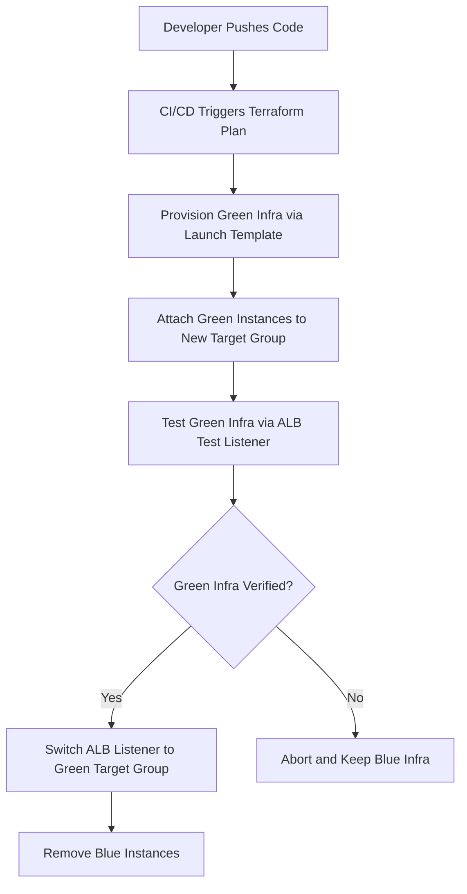

# Immutable Infra Rollout for Blue Green
| Created        | Last updated      | Version         | author|  Internal Reviewer | L0 | L1 | L2|
|----------------|----------------|-----------------|-----------------|-----|------|----|----|
| 2025-07-05  | 2025-07-05   |     Version 1         |  Mohamed Tharik |Priyanshu|Khushi|Mukul Joshi |Piyush Upadhyay|

## Table of Contents

- [Introduction](#introduction)
- [Overview of Blue-Green Deployment](#overview-of-blue-green-deployment)
- [Prerequisites](#prerequisites)
- [Flow Diagram of Infrastructure Rollout for Blue Green](#flow-diagram-of-infrastructure-rollout-for-blue-green)
- [Terraform Implementation Strategy](#terraform-implementation-strategy)
- [Implementation for Blue Green Deployment](#implementation-for-blue-green-deployment)
  - [Step 1: Initialize Terraform Project](#step-1-initialize-terraform-project)
  - [Step 2: Project Directory Structure](#step-2-project-directory-structure)
  - [Step 3: Define AWS Provider](#step-3-define-aws-provider)
  - [Step 4: Run the Terraform Commands to Apply and see changes in the Cloud](#step-4-run-the-terraform-commands-to-apply-and-see-changes-in-the-cloud)
  - [Step 5: Switch Traffic to Green](#step-5-switch-traffic-to-green)
- [Best Practices](#best-practices)
- [Conclusion](#conclusion)
- [Contact Information](#contact-information)
- [References](#references)

## Introduction
This document explains how to implement **Blue-Green Deployment using Terraform** with an **Immutable Infrastructure** approach. It describes how two separate environments (blue and green) are used to deploy and switch application versions safely without downtime. Terraform automates the provisioning, switching, and removal of infrastructure components.

## Overview of Blue-Green Deployment
Blue-Green Deployment strategy involves maintaining **two identical environments**:
- **Blue** – The currently running production environment.
- **Green** – The new version of the application deployed separately.

Once the green environment is tested and verified, the **traffic is switched** from blue to green via **ALB (Application Load Balancer)** or **Route53**. The **old (blue) environment can then be terminated**, ensuring **zero-downtime** and full rollback capability.

## Prerequisites
| **Category**        | **Requirement**                                                                  |
| ------------------- | -------------------------------------------------------------------------------- |
| **AWS Access**      | Active AWS account with permissions for EC2, ALB, ASG, IAM, VPC                  |
| **Terraform**       | Installed (v1.x or above), configured with AWS credentials                       |
| **Pre-built AMI**   | AMI available for deploying application immutably (e.g., built via Packer)       |
| **VPC Setup**       | VPC, subnets, security groups, and internet/NAT gateway configured               |
| **CI/CD Tool**      | Optional: Jenkins, GitHub Actions, etc. for automation                           |
| **Terraform Code**  | Modules/files: `main.tf`, `variables.tf`, `outputs.tf`, etc. structured properly |
| **Basic Knowledge** | Understanding of Terraform, AWS, Blue-Green Deployment, and Immutable Infra      |
| **Version Control** | Git repository for managing and tracking Terraform code                          |

## Flow Diagram of Infrastructure Rollout for Blue Green 

## Terraform Implementation Strategy
### Key Terraform Components:
| Resource                           | Purpose                                                                  |
| ---------------------------------- | ------------------------------------------------------------------------ |
| `aws_launch_template`              | Defines immutable server config for app (AMI, userdata)                  |
| `aws_autoscaling_group`            | Maintains EC2 instances for blue/green                                   |
| `aws_lb` and `aws_lb_target_group` | ALB with two Target Groups (Blue, Green)                                 |
| `aws_lb_listener`                  | Routes traffic to the active TG (blue/green)                             |
| `aws_route53_record` (Optional)    | Switch DNS if Route53 is used instead of ALB                             |
| `count` or `for_each`              | Used to dynamically create blue or green infra based on deployment phase |

## Implementation for Blue Green Deployment 
### Step 1: Initialize Terraform Project
Create a folder:
```bash
mkdir blue-green-deployment && cd blue-green-deployment
```
### Step 2: Project Directory Structure
```bash
blue-green-deployment/
├── provider.tf
├── variables.tf
├── terraform.tfvars
├── alb.tf
├── asg_blue.tf
├── asg_green.tf
├── outputs.tf
├── userdata-blue.sh
├── userdata-green.sh     
```
### Step 3: Define AWS Provider
**File**: `provider.tf`
```bash
provider "aws" {
  region = var.aws_region
}
```
**File**: `variables.tf`
```bash
variable "aws_region" {}
variable "vpc_id" {}
variable "subnet_ids" {
  type = list(string)
}
variable "security_group_id" {}
variable "ami_id" {}
variable "instance_type" {
  default = "t2.micro"
}
```
**File**: `terraform.tfvars`
```bash
aws_region         = "ap-south-1"
vpc_id             = "vpc-xxxxxxxx"
subnet_ids         = ["subnet-aaaaaaa", "subnet-bbbbbbb"]
security_group_id  = "sg-xxxxxxxx"
ami_id             = "ami-1234567890abcdefg"  
instance_type      = "t2.micro"
```
**File**: `alb.tf`
```bash
resource "aws_lb" "app_alb" {
  name               = "blue-green-alb"
  internal           = false
  load_balancer_type = "application"
  subnets            = var.subnet_ids
}

resource "aws_lb_target_group" "blue_tg" {
  name     = "blue-tg"
  port     = 80
  protocol = "HTTP"
  vpc_id   = var.vpc_id
}

resource "aws_lb_target_group" "green_tg" {
  name     = "green-tg"
  port     = 80
  protocol = "HTTP"
  vpc_id   = var.vpc_id
}

resource "aws_lb_listener" "http" {
  load_balancer_arn = aws_lb.app_alb.arn
  port              = 80
  protocol          = "HTTP"

  default_action {
    type             = "forward"
    target_group_arn = aws_lb_target_group.blue_tg.arn
  }
}
```
**File**: `asg_blue.tf`
```bash
resource "aws_launch_template" "blue_lt" {
  name_prefix   = "blue-lt-"
  image_id      = var.ami_id
  instance_type = var.instance_type
  user_data     = filebase64("userdata-blue.sh")
  vpc_security_group_ids = [var.security_group_id]
}

resource "aws_autoscaling_group" "blue_asg" {
  desired_capacity     = 1
  max_size             = 1
  min_size             = 1
  vpc_zone_identifier  = var.subnet_ids
  target_group_arns    = [aws_lb_target_group.blue_tg.arn]

  launch_template {
    id      = aws_launch_template.blue_lt.id
    version = "$Latest"
  }

  health_check_type = "EC2"
}
```
**File**: `asg_green.tf`
```bash
resource "aws_launch_template" "green_lt" {
  name_prefix   = "green-lt-"
  image_id      = var.ami_id
  instance_type = var.instance_type
  user_data     = filebase64("userdata-green.sh")
  vpc_security_group_ids = [var.security_group_id]
}

resource "aws_autoscaling_group" "green_asg" {
  desired_capacity     = 1
  max_size             = 1
  min_size             = 1
  vpc_zone_identifier  = var.subnet_ids
  target_group_arns    = [aws_lb_target_group.green_tg.arn]

  launch_template {
    id      = aws_launch_template.green_lt.id
    version = "$Latest"
  }

  health_check_type = "EC2"
}
```
**File**: `outputs.tf`
```bash 
output "alb_dns" {
  value = aws_lb.app_alb.dns_name
}
```
**File**: `userdata-blue.sh`
```bash
#!/bin/bash
apt update -y
apt install -y apache2
echo "Welcome to the BLUE version - v1" > /var/www/html/index.html
echo "<h1>Blue Deployment - Version 1</h1>" >> /var/www/html/index.html
echo "<p>Served by a Debian-based EC2 instance</p>" >> /var/www/html/index.html
systemctl start apache2
systemctl enable apache2
```
**File**: `userdata-green.sh`
```bash
#!/bin/bash
apt update -y
apt install -y apache2
echo "Welcome to the GREEN version - v2" > /var/www/html/index.html
echo "<h1>Green Deployment - Version 2</h1>" >> /var/www/html/index.html
echo "<p>Deployed using Terraform Launch Template on Debian</p>" >> /var/www/html/index.html
systemctl start apache2
systemctl enable apache2
```
### Step 4: Run the Terraform Commands to Apply and see changes in the Cloud 
```bash
terraform init
terraform apply -var-file="terraform.tfvars"
```
Visit the alb_dns output URL
### Step 5: Switch Traffic to Green
Edit `alb.tf`:
```bash 
  default_action {
    type             = "forward"
    target_group_arn = aws_lb_target_group.green_tg.arn
  }
```
Then re-apply:
```bash
terraform apply -var-file="terraform.tfvars"
```
Now ALB points to Green version — visit `alb_dns` again to confirm.

## Best Practices
| Best Practice                       | Description                                                                                               |
| ----------------------------------- | --------------------------------------------------------------------------------------------------------- |
| **Use Immutable Infrastructure**    | Always deploy new versions using new launch templates and EC2 instances—never update in place.            |
| **Separate Target Groups**          | Maintain distinct ALB target groups for Blue and Green to safely switch traffic and rollback if needed.   |
| **Validate Green Before Switching** | Always test the green environment using a test listener or direct IP before routing live traffic.         |
| **Use Remote State with Locking**   | Store Terraform state in S3 and enable DynamoDB locking to avoid concurrent update issues.                |
| **Clean Up Old Environments**       | After successful switch to green, destroy the blue environment to save cost and avoid confusion.          |
| **Integrate with CI/CD**            | Automate Terraform apply/switch/destroy steps using Jenkins or GitHub Actions with manual approval gates. |

## Conclusion
Blue-Green Deployment with Immutable Infrastructure provides **safe, zero-downtime deployments**. Using Terraform ensures consistent and repeatable rollouts. This strategy improves reliability, allows quick rollback, and aligns with modern DevOps practices.

## Contact Information
| Name | Email address         |
|------|------------------------|
| Mohamed Tharik  | md.tharik.sanaatak@mygurukulam.co    |

## References
| Link                                                                                                                              | Description                                                                                   |
|-----------------------------------------------------------------------------------------------------------------------------------|-----------------------------------------------------------------------------------------------|
| [Blue/Green Deployment – Martin Fowler](https://martinfowler.com/bliki/BlueGreenDeployment.html)                                 | Core concept explanation of Blue-Green deployment strategy from Martin Fowler.                |
| [Immutable Infrastructure – Red Hat](https://www.redhat.com/en/topics/devops/what-is-immutable-infrastructure)                   | Explains the benefits and working of immutable infrastructure in a DevOps context.            |
| [Blue-Green Deployments with Terraform on AWS – Gruntwork](https://blog.gruntwork.io/a-comprehensive-guide-to-blue-green-deployments-on-aws-using-terraform-8348e8f23f3f) | Practical implementation of Blue-Green deployments using Terraform and AWS services.          |
| [AWS Whitepaper – Blue/Green Deployment](https://docs.aws.amazon.com/whitepapers/latest/overview-deployment-options/bluegreen-deployments.html) | Official AWS deployment strategies whitepaper including Blue-Green.                          |
| [Terraform AWS Autoscaling Module](https://registry.terraform.io/modules/terraform-aws-modules/autoscaling/aws/latest)           | Official Terraform module to manage AWS Auto Scaling Groups for immutable infra.              |
| [EC2 Launch Templates – AWS Docs](https://docs.aws.amazon.com/AWSEC2/latest/UserGuide/ec2-launch-templates.html)                 | Used to define immutable EC2 instance configurations.                                         |
| [ALB Listener Rules – AWS Docs](https://docs.aws.amazon.com/elasticloadbalancing/latest/application/load-balancer-listeners.html)| Key to switching traffic between Blue and Green environments using ALB target groups.         |


