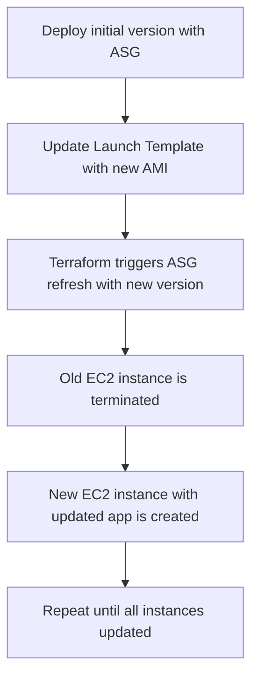

<p align="center">
  
</p>  

# Immutable Infra Rollout for Rolling Deployment

| Created    | Last updated | Version   | Author         | Internal Reviewer | L0     | L1          | L2              |
| ---------- | ------------ | --------- | -------------- | ----------------- | ------ | ----------- | --------------- |
| 2025-07-05 | 2025-07-05   | Version 1 | Mohamed Tharik | Priyanshu         | Khushi | Mukul Joshi | Piyush Upadhyay |

## Table of Contents

* [Introduction](#introduction)
* [Overview of Rolling Deployment](#overview-of-rolling-deployment)
* [Prerequisites](#prerequisites)
* [Rolling Deployment Strategy Flow](#rolling-deployment-strategy-flow)
* [Terraform Implementation Strategy](#terraform-implementation-strategy)
* [Implementation for Rolling Deployment](#implementation-for-rolling-deployment)
  * [Step 1: Directory Structure](#step-1-directory-structure)
  * [Step 2: Terraform Provider and Variables](#step-2-terraform-provider-and-variables)
  * [Step 3: Launch Template and ASG](#step-3-launch-template-and-asg)
  * [Step 4: Run the Terraform Commands to Apply and see changes in the Cloud](#step-4-run-the-terraform-commands-to-apply-and-see-changes-in-the-cloud)
* [Best Practices](#best-practices)
* [Conclusion](#conclusion)
* [Contact Information](#contact-information)
* [References](#references)

## Introduction

This document outlines the process of implementing **Rolling Deployment using Terraform** with an **Immutable Infrastructure** model. It allows for gradual replacement of old instances with new ones without downtime.

## Overview of Rolling Deployment

Rolling deployment involves **incrementally replacing old application instances** with new ones. Each instance is terminated and replaced with the new version **one at a time (or in batches)**, helping maintain availability throughout the rollout.

## Prerequisites

| **Category**        | **Requirement**                                                           |
| ------------------- | ------------------------------------------------------------------------- |
| **AWS Access**      | Permissions for EC2, ALB, ASG, IAM, VPC                                   |
| **Terraform**       | Installed and configured with AWS credentials                             |
| **Immutable AMI**   | Separate AMIs for old and new app versions (optional but recommended)     |
| **VPC Setup**       | Existing VPC, subnets, and security groups                                |
| **Terraform Files** | Terraform code files with modular structure                               |
| **Basic Knowledge** | Understanding of ASG lifecycle hooks and rolling update strategies in AWS |

## Rolling Deployment Strategy Flow



## Terraform Implementation Strategy

Key AWS Resources:

| Resource                 | Purpose                                                            |
| ------------------------ | ------------------------------------------------------------------ |
| `aws_launch_template`    | Defines EC2 configuration (AMI, userdata, SG)                      |
| `aws_autoscaling_group`  | Maintains desired EC2 capacity, triggers instance refresh          |
| `aws_lb_target_group`    | Routes requests to healthy instances                               |
| `update_default_version` | Controls which Launch Template version ASG uses for rolling update |

## Implementation for Rolling Deployment

### Step 1: Directory Structure

```bash
rolling-deployment/
├── provider.tf
├── variables.tf
├── terraform.tfvars
├── launch_template.tf
├── asg.tf
├── alb.tf
├── outputs.tf
├── userdata.sh
```

### Step 2: Terraform Provider and Variables

**provider.tf**

```hcl
provider "aws" {
  region = var.aws_region
}
```

**variables.tf**

```hcl
variable "aws_region" {}
variable "vpc_id" {}
variable "subnet_ids" { type = list(string) }
variable "security_group_id" {}
variable "ami_id" {}
variable "instance_type" { default = "t2.micro" }
```

**terraform.tfvars**

```hcl
aws_region         = "ap-south-1"
vpc_id             = "vpc-xxxxxxxx"
subnet_ids         = ["subnet-aaaaaaa", "subnet-bbbbbbb"]
security_group_id  = "sg-xxxxxxxx"
ami_id             = "ami-xxxxxxxxxxxxxxxxx"
```

### Step 3: Launch Template and ASG

**launch\_template.tf**

```hcl
resource "aws_launch_template" "app_lt" {
  name_prefix   = "rolling-lt-"
  image_id      = var.ami_id
  instance_type = var.instance_type
  user_data     = filebase64("userdata.sh")
  vpc_security_group_ids = [var.security_group_id]
}
```

**asg.tf**

```hcl
resource "aws_autoscaling_group" "app_asg" {
  desired_capacity     = 2
  max_size             = 3
  min_size             = 1
  vpc_zone_identifier  = var.subnet_ids
  target_group_arns    = [aws_lb_target_group.app_tg.arn]

  launch_template {
    id      = aws_launch_template.app_lt.id
    version = "$Latest"
  }

  health_check_type         = "EC2"
  health_check_grace_period = 30
  force_delete              = true
  lifecycle {
    create_before_destroy = true
  }
  instance_refresh {
    strategy = "Rolling"
    preferences {
      min_healthy_percentage = 50
    }
    triggers = ["launch_template"]
  }
}
```

### Step 4: Run the Terraform Commands to Apply and see changes in the Cloud

```bash
terraform init
terraform apply -var-file="terraform.tfvars"
```

Update `ami_id` in `terraform.tfvars` with a new AMI and re-apply:

```bash
terraform apply -var-file="terraform.tfvars"
```

## Best Practices

| Practice                    | Description                                                                 |
| --------------------------- | --------------------------------------------------------------------------- |
| **Use Launch Templates**    | Ensures repeatability and enables smooth rollouts.                          |
| **Enable Instance Refresh** | Ensures safe rollout of new instances.                                      |
| **Use Health Checks**       | Attach ALB with health checks to prevent traffic to failed deployments.     |
| **Gradual Update**          | Use small batch size or min\_healthy\_percentage for controlled deployment. |
| **Use Remote State**        | Store Terraform state in S3 and lock using DynamoDB.                        |
| **Monitor Rollouts**        | Monitor logs and ALB target health during update.                           |

## Conclusion

Rolling deployments provide a safe and controlled way to update applications without downtime. Terraform with AWS Auto Scaling instance refresh simplifies this process while ensuring infrastructure immutability.

## Contact Information

| Name           | Email address                                                                 |
| -------------- | ----------------------------------------------------------------------------- |
| Mohamed Tharik | [md.tharik.sanaatak@mygurukulam.co](mailto:md.tharik.sanaatak@mygurukulam.co) |

## References

| Link                                                                                                                             | Description                                                                 |
| -------------------------------------------------------------------------------------------------------------------------------- | --------------------------------------------------------------------------- |
| [Rolling Deployments with Terraform – AWS Docs](https://docs.aws.amazon.com/autoscaling/ec2/userguide/asg-instance-refresh.html) | Official AWS documentation on using instance refresh in rolling deployments |
| [Terraform Instance Refresh](https://developer.hashicorp.com/terraform/docs/language/meta-arguments/depends_on)                  | Terraform documentation on instance\_refresh and rolling update strategy    |
| [Immutable Infrastructure – Red Hat](https://www.redhat.com/en/topics/devops/what-is-immutable-infrastructure)                   | Explanation of immutable infra and its DevOps benefits                      |
| [Terraform Auto Scaling Module](https://registry.terraform.io/modules/terraform-aws-modules/autoscaling/aws/latest)              | Reusable module supporting rolling deployment with instance refresh         |
| [Blue/Green vs Rolling Strategy – Atlassian](https://www.atlassian.com/continuous-delivery/blue-green-deployment)                | Overview comparison between blue-green and rolling deployments              |
