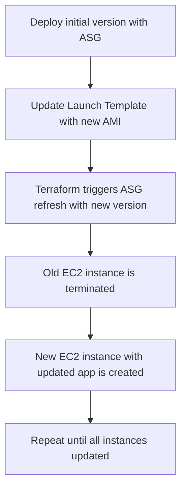

<p align="center">
  
</p>  

# Immutable Infra Rollout for Rolling Deployment

| Created    | Last updated | Version   | Author         | Internal Reviewer | L0     | L1          | L2              |
| ---------- | ------------ | --------- | -------------- | ----------------- | ------ | ----------- | --------------- |
| 2025-07-05 | 2025-07-05   | Version 1 | Mohamed Tharik | Priyanshu         | Khushi | Mukul Joshi | Piyush Upadhyay |

## Table of Contents

* [Introduction](#introduction)
* [Overview of Rolling Deployment](#overview-of-rolling-deployment)
* [Prerequisites](#prerequisites)
* [Rolling Deployment Strategy Flow](#rolling-deployment-strategy-flow)
* [Terraform Implementation Strategy](#terraform-implementation-strategy)
* [Implementation for Rolling Deployment](#implementation-for-rolling-deployment)
  * [Step 1: Directory Structure](#step-1-directory-structure)
  * [Step 2: Terraform Provider and Variables](#step-2-terraform-provider-and-variables)
  * [Step 3: Launch Template and ASG](#step-3-launch-template-and-asg)
  * [Step 4: Run the Terraform Commands to Apply and see changes in the Cloud](#step-4-run-the-terraform-commands-to-apply-and-see-changes-in-the-cloud)
* [Best Practices](#best-practices)
* [Conclusion](#conclusion)
* [Contact Information](#contact-information)
* [References](#references)

## Introduction

This document outlines the process of implementing **Rolling Deployment using Terraform** with an **Immutable Infrastructure** model. It allows for gradual replacement of old instances with new ones without downtime.

## Overview of Rolling Deployment

Rolling deployment involves **incrementally replacing old application instances** with new ones. Each instance is terminated and replaced with the new version **one at a time (or in batches)**, helping maintain availability throughout the rollout.

## Prerequisites

| **Category**        | **Requirement**                                                           |
| ------------------- | ------------------------------------------------------------------------- |
| **AWS Access**      | Permissions for EC2, ALB, ASG, IAM, VPC                                   |
| **Terraform**       | Installed and configured with AWS credentials                             |
| **Immutable AMI**   | Separate AMIs for old and new app versions (optional but recommended)     |
| **VPC Setup**       | Existing VPC, subnets, and security groups                                |
| **Terraform Files** | Terraform code files with modular structure                               |
| **Basic Knowledge** | Understanding of ASG lifecycle hooks and rolling update strategies in AWS |

## Rolling Deployment Strategy Flow



## Terraform Implementation Strategy

Key AWS Resources:

| Resource                 | Purpose                                                            |
| ------------------------ | ------------------------------------------------------------------ |
| `aws_launch_template`    | Defines EC2 configuration (AMI, userdata, SG)                      |
| `aws_autoscaling_group`  | Maintains desired EC2 capacity, triggers instance refresh          |
| `aws_lb_target_group`    | Routes requests to healthy instances                               |
| `update_default_version` | Controls which Launch Template version ASG uses for rolling update |

## Implementation for Rolling Deployment

### Step 1: Directory Structure

```bash
rolling-deployment/
├── provider.tf
├── variables.tf
├── terraform.tfvars
├── launch_template.tf
├── asg.tf
├── alb.tf
├── outputs.tf
├── userdata.sh
```

### Step 2: Terraform Provider and Variables

**provider.tf**

```hcl
provider "aws" {
  region = var.aws_region
}
```

**variables.tf**

```hcl
variable "instance_type" {
  default = "t2.micro"
}
```
**data.tf**

```hcl
data "aws_vpc" "default" {
  default = true
}

data "aws_subnets" "default" {
  filter {
    name   = "vpc-id"
    values = [data.aws_vpc.default.id]
  }
}

data "aws_ami" "ubuntu" {
  most_recent = true
  owners      = ["099720109477"]

  filter {
    name   = "name"
    values = ["ubuntu/images/hvm-ssd/ubuntu-focal-20.04-amd64-server-*"]
  }

  filter {
    name   = "virtualization-type"
    values = ["hvm"]
  }
}
```

### Step 3: Launch Template , ASG and ALB 

**launch_template.tf**

```hcl
resource "aws_launch_template" "app_lt" {
  name_prefix   = "rolling-app-"
  image_id      = data.aws_ami.ubuntu.id
  instance_type = var.instance_type

  user_data = base64encode(file("userdata.sh"))

  lifecycle {
    create_before_destroy = true
  }

  tag_specifications {
    resource_type = "instance"
    tags = {
      Name = "rolling-instance-new"
    }
  }
}

```

**asg.tf**

```hcl
resource "aws_autoscaling_group" "app_asg" {
  name                      = "rolling-asg"
  min_size                  = 2
  max_size                  = 2
  desired_capacity          = 2
  vpc_zone_identifier       = data.aws_subnets.default.ids
  target_group_arns         = [aws_lb_target_group.app_tg.arn]
  health_check_type         = "ELB"
  health_check_grace_period = 30

  launch_template {
    id      = aws_launch_template.app_lt.id
    version = "$Latest"
  }

  tag {
    key                 = "Name"
    value               = "rolling-instance-new"
    propagate_at_launch = true
  }

  lifecycle {
    create_before_destroy = true
    ignore_changes        = [launch_template[0].version]
  }
}
```
**alb.tf**
```hcl
resource "aws_lb" "app_alb" {
  name               = "rolling-alb"
  load_balancer_type = "application"
  subnets            = data.aws_subnets.default.ids
  security_groups    = [aws_security_group.alb_sg.id]
}

resource "aws_lb_target_group" "app_tg" {
  name     = "rolling-tg"
  port     = 80
  protocol = "HTTP"
  vpc_id   = data.aws_vpc.default.id

  health_check {
    path                = "/"
    protocol            = "HTTP"
    interval            = 30
    healthy_threshold   = 2
    unhealthy_threshold = 2
  }
}

resource "aws_lb_listener" "app_listener" {
  load_balancer_arn = aws_lb.app_alb.arn
  port              = 80
  protocol          = "HTTP"

  default_action {
    type             = "forward"
    target_group_arn = aws_lb_target_group.app_tg.arn
  }
}

resource "aws_security_group" "alb_sg" {
  name        = "alb-sg"
  description = "Allow HTTP"
  vpc_id      = data.aws_vpc.default.id

  ingress {
    from_port   = 80
    to_port     = 80
    protocol    = "tcp"
    cidr_blocks = ["0.0.0.0/0"]
  }

  egress {
    from_port   = 0
    to_port     = 0
    protocol    = "-1"
    cidr_blocks = ["0.0.0.0/0"]
  }
}
```
**outputs.tf**
```hcl
output "alb_dns_name" {
  value = aws_lb.app_alb.dns_name
}
```
**userdata.sh**
```bash
#!/bin/bash
sudo apt update -y
sudo apt install -y nginx -y

DEPLOY_TIME=$(date)
HOSTNAME=$(hostname)

cat <<EOF | sudo tee /var/www/html/index.html
<!DOCTYPE html>
<html>
<head>
  <title>Rolling Deployment</title>
  <style>
    body { font-family: Arial, sans-serif; text-align: center; margin-top: 50px; background-color: #f5f5f5; }
    .box { background: white; padding: 30px; margin: auto; width: 60%; box-shadow: 0 0 10px rgba(0,0,0,0.1); }
    h1 { color: #4CAF50; }
    .meta { color: gray; font-size: 0.9em; }
  </style>
</head>
<body>
  <div class="box">
    <h1>🚀 Rolling Deployment Active</h1>
    <p><strong>Version:</strong> <span style="color: #2196F3;">New Version - v1.0</span></p>
    <p class="meta">Instance: $HOSTNAME</p>
    <p class="meta">Deployed at: $DEPLOY_TIME</p>
    <p>✅ Successfully Deployed Using <strong>Terraform Rolling Update</strong></p>
  </div>
</body>
</html>
EOF

sudo systemctl start nginx
```
### Step 4: Run the Terraform Commands to Apply and see changes in the Cloud

```bash
terraform init
terraform validate
terrafrom plan 
terraform apply -var-file="terraform.tfvars"
```

Update `userdata.sh` and re-apply:

```bash
terraform apply 
```

## Best Practices

| Practice                    | Description                                                                 |
| --------------------------- | --------------------------------------------------------------------------- |
| **Use Launch Templates**    | Ensures repeatability and enables smooth rollouts.                          |
| **Enable Instance Refresh** | Ensures safe rollout of new instances.                                      |
| **Use Health Checks**       | Attach ALB with health checks to prevent traffic to failed deployments.     |
| **Gradual Update**          | Use small batch size or min\_healthy\_percentage for controlled deployment. |
| **Use Remote State**        | Store Terraform state in S3 and lock using DynamoDB.                        |
| **Monitor Rollouts**        | Monitor logs and ALB target health during update.                           |

## Conclusion

Rolling deployments provide a safe and controlled way to update applications without downtime. Terraform with AWS Auto Scaling instance refresh simplifies this process while ensuring infrastructure immutability.

## Contact Information

| Name           | Email address                                                                 |
| -------------- | ----------------------------------------------------------------------------- |
| Mohamed Tharik | [md.tharik.sanaatak@mygurukulam.co](mailto:md.tharik.sanaatak@mygurukulam.co) |

## References

| Link                                                                                                                             | Description                                                                 |
| -------------------------------------------------------------------------------------------------------------------------------- | --------------------------------------------------------------------------- |
| [Rolling Deployments with Terraform – AWS Docs](https://docs.aws.amazon.com/autoscaling/ec2/userguide/asg-instance-refresh.html) | Official AWS documentation on using instance refresh in rolling deployments |
| [Terraform Instance Refresh](https://developer.hashicorp.com/terraform/docs/language/meta-arguments/depends_on)                  | Terraform documentation on instance\_refresh and rolling update strategy    |
| [Immutable Infrastructure – Red Hat](https://www.redhat.com/en/topics/devops/what-is-immutable-infrastructure)                   | Explanation of immutable infra and its DevOps benefits                      |
| [Terraform Auto Scaling Module](https://registry.terraform.io/modules/terraform-aws-modules/autoscaling/aws/latest)              | Reusable module supporting rolling deployment with instance refresh         |
| [Blue/Green vs Rolling Strategy – Atlassian](https://www.atlassian.com/continuous-delivery/blue-green-deployment)                | Overview comparison between blue-green and rolling deployments              |
